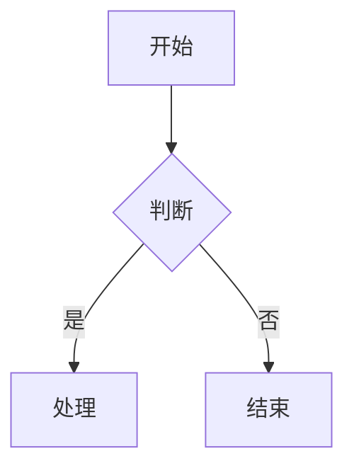
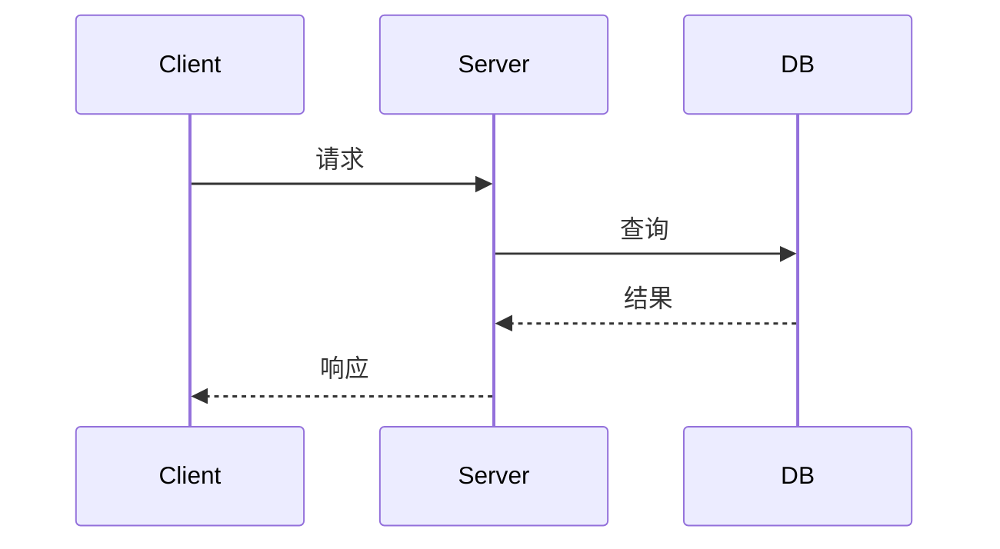
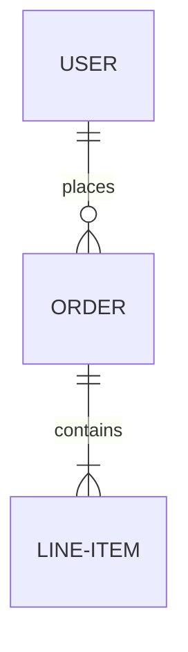
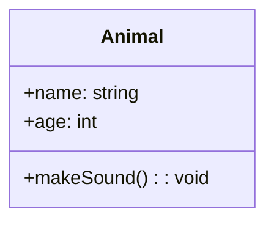
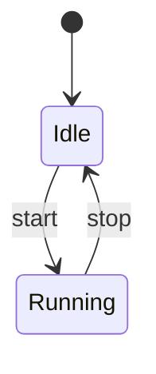
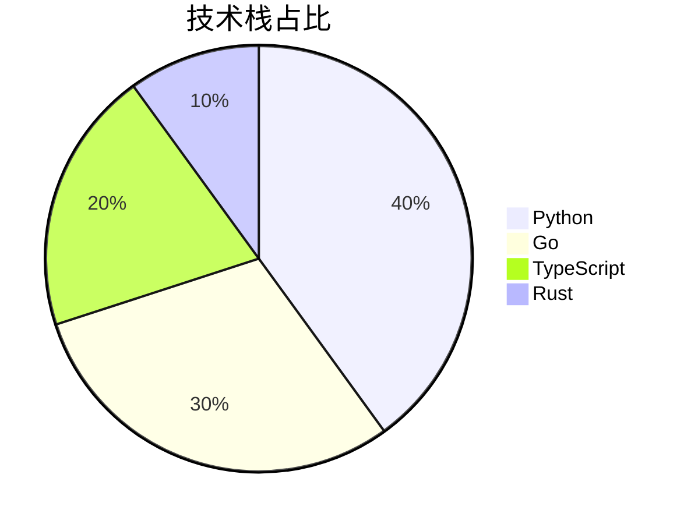
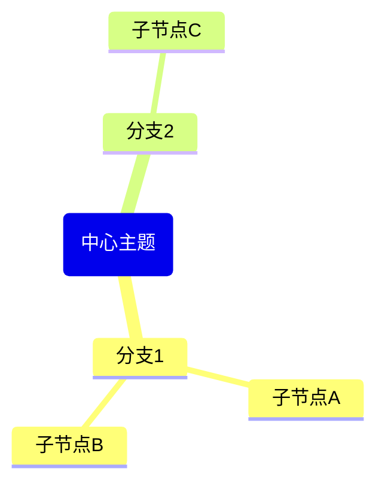

# f-diagram — 代码驱动图表生成

从代码生成图表。Mermaid 主力，whiteboard-cli 渲染 SVG 白板。调用方负责嵌入飞书文档。

## 安装

```bash
npm install -g @larksuite/whiteboard-cli
```

## 快速决策

```
用户意图
  ├─ "画架构图"/"流程图"          → Mermaid flowchart
  ├─ "画时序图"/"序列图"          → Mermaid sequenceDiagram
  ├─ "画ER图"/"实体关系图"        → Mermaid erDiagram
  ├─ "画类图"                    → Mermaid classDiagram
  ├─ "画状态图"                  → Mermaid stateDiagram
  ├─ "画甘特图"                  → Mermaid gantt
  ├─ "画饼图"（结构）            → Mermaid pie
  ├─ "画思维导图"                → Mermaid mindmap
  └─ "画白板"/SVG 示意图         → whiteboard-cli
```

## Mermaid 语法速查

### Flowchart（架构/流程）


### SequenceDiagram（时序）


### ER Diagram（实体关系）


### ClassDiagram（类图）


### StateDiagram（状态机）


### Gantt（甘特图）


### Pie（结构饼图）


### Mindmap（思维导图）


## whiteboard-cli

```bash
npx -y @larksuite/whiteboard-cli@^0.2.10
```

SVG 白板用于 Mermaid 不支持的场景（自由布局、标注、手绘风格）。

## 飞书文档嵌入

图表嵌入飞书文档时，委托 f-feishu skill：

```
f-diagram 生成图表代码 → f-feishu 插入飞书文档
```

规则：
- 飞书文档中图表 MUST 用 `<whiteboard type="mermaid">` XML 语法
- 禁止 ASCII 字符画
- 禁止 Markdown fenced code block（飞书不认 ` ```mermaid `）
- 白板只能 `block_insert_after` 插入，不能 `str_replace` 插 `<whiteboard>` 标签
- 图表在对应内容位置嵌入，不在文档末尾

### 飞书 Mermaid 支持的类型
flowchart, sequenceDiagram, erDiagram, classDiagram, stateDiagram, gantt, pie, mindmap

### 不支持
radar-beta, quadrantChart, gitGraph, timeline（飞书白板限制）

## 未来扩展

- PlantUML（时序图/用例图/部署图）
- D2（现代化架构图）
- Graphviz（关系图/网络拓扑）

## 工具委托

| 操作 | 工具 | 命令 |
|------|------|------|
| 生成图表代码 | Claude LLM | 本 skill 语法速查 |
| 渲染 SVG 白板 | whiteboard-cli | `npx -y @larksuite/whiteboard-cli@^0.2.10` |
| 嵌入飞书文档 | f-feishu | 委托 f-feishu skill |
